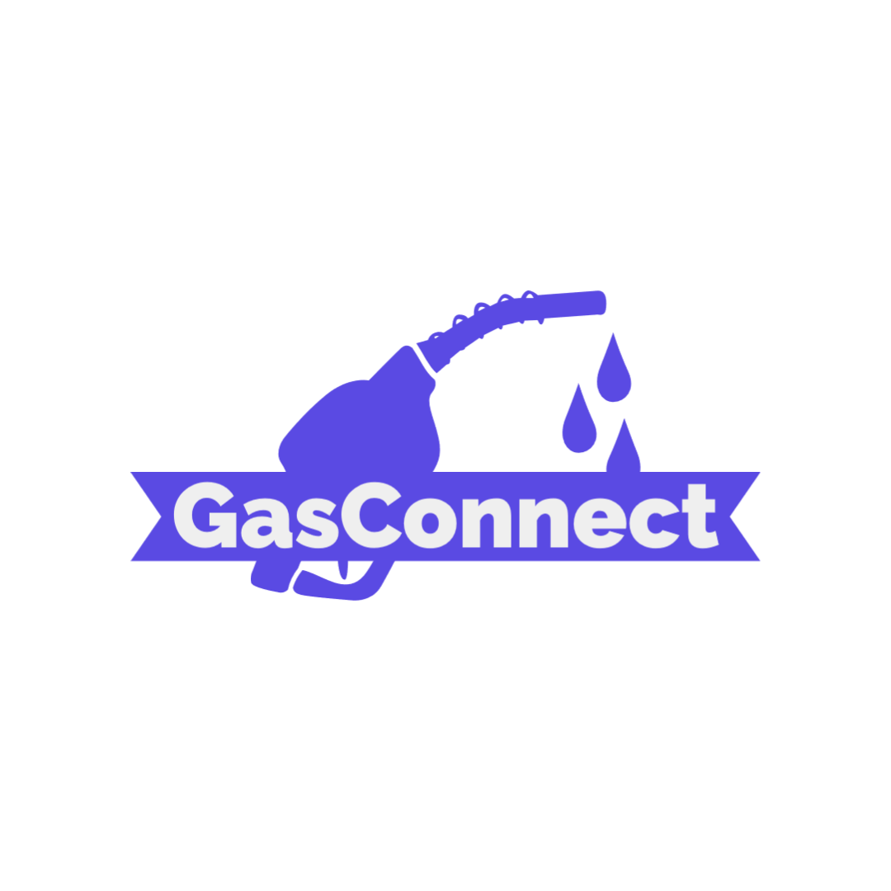

# GasConnect (v1.0)



## DESCRIPTION <br>
Finding the best deal for gas in different locations is a challenge, with different companies offering gas at different prices. Refilling a car in a new location becomes more challenging since one may not have experience of the location, thus making it a challenge worth looking into. The app idea was developed to solve the problem of getting cheap gas deals, finding reputable gas stations in new locations, and getting updates on gas availability in each gas station


## Table of Contents

1. [Manifest](#manifest)
2. [Style Examples](#style-examples)
3. [Embedding Code](#embedding-code)
4. [Embedding Links](embedding-links)
5. [Embedding Images](#embedding-images)
6. [Lists In Markdown](#lists-in-markdown)
7. [Necessary Things for a README](#necessary-things-for-a-readme)

## Manifest

- A manifest is a list of the top-level files in a project with a description of what each file is.

```
- newfile.txt --> A new file that says stuff in it
- README.md ----> This markdown file you are reading.
- img ----------> Images folder for the readme
```

## Style Examples

_Italics!_

**Bold!**

_**Bold-Italics!**_

~~strikethru~~

:coffee::cat::happy:

In the words of Abraham Lincoln:

> "Pardon my French!"

## Embedding Code

```cpp
int myFunc(int a int b){
    int c = a+b;
    return c;
}
```

## Embedding Links

You can host websites at [Github Pages](https://pages.github.com/)!

You can also do relative links [newfile.txt](newfile.txt)


## Lists in Markdown

Here's a list of cool pokemon:

- Mew
- Mewtwo
- Celebi
- Arceus
- Porygon
- Mimikyu

Here's a list of my favorite pens:

1. Lamy 200
2. Herbin
3. Pilot

Here's a nested list!

1. This is a number
   1. This is a sub-number
   2. This is another sub-number
2. This is a number
   - This is a subpoint
   - This is another sub-point
     1. This is a sub-sub number

## Necessary Things for a README

Depending on exactly what sort of project you are doing, there are a number of things that you may or may not want to include in a readme. There is really no **one true way** to do it. Readme's are a kind of _artform_.

*__However__* there are a few things that you should consider including:

1. Name of your project.
2. Description of your project.
3. Badges.
4. Graphics / Visuals
5. Install Instructions
6. Usage (how does one use the program once it is installed.)
7. Support / Contact Details.
8. Road-map (future ideas)
9. How to contribute
10. Authors / Acknowledgements (give credit where credit is due!)
11. License
12. Project Status

## Name of your Project

- This should be, simply, the name of your project.. maybe with some kind of a version Number

## Description of your project

- This is a brief, but accurate description telling potential users _exactly_ what your project is about. This is akin to an "abstract" in academic works. 

## Badges


- Badges are small images that convey meta data such as whether or not all the tests are passing, version numbers, languages used, etc. 
- Get badges at shields.io

## Visuals

- Visuals are very important! You might want to include screenshots of your code in operation. GIFS are also great!
- Just use the "" to input images.

## Installation 

- Describe how your software / development is installed. Sometimes it's easy as something like:

```bash
sudo apt-get install my-cool-thing
```

- often it involves a bit of  downloading sources and building:

```bash
git clone my-cool-repo.git
cd /my-cool-repo
cd /build
make
```

- You should list out steps as unambiguously as humanly possible!!
- Often people don't read the actual install instructions, but they just copy and paste what is in the black boxes. __Keep this in mind!__

## Usage

- Describe how the program / project is going to be used once it is installed. 
- If it is a command line app, you'll want to give CLI examples:

```bash
cool-project -arg1 -arg2
```

- then maybe show a screenshot of  the results :smile:

## Support

- tell users how they can get a hold of you

Contact: [email me](trevor.tomesh@gmail.com)

## Road-map

- Ability to find gas stations using users GPS location
- Ability to find a certain type of fuel grade
- Expanding of service within the whole Canada with the use of GPS location


## License

Open Software License 3.0	osl-3.0

## Project Status

- Future updates to the project are active


​    
